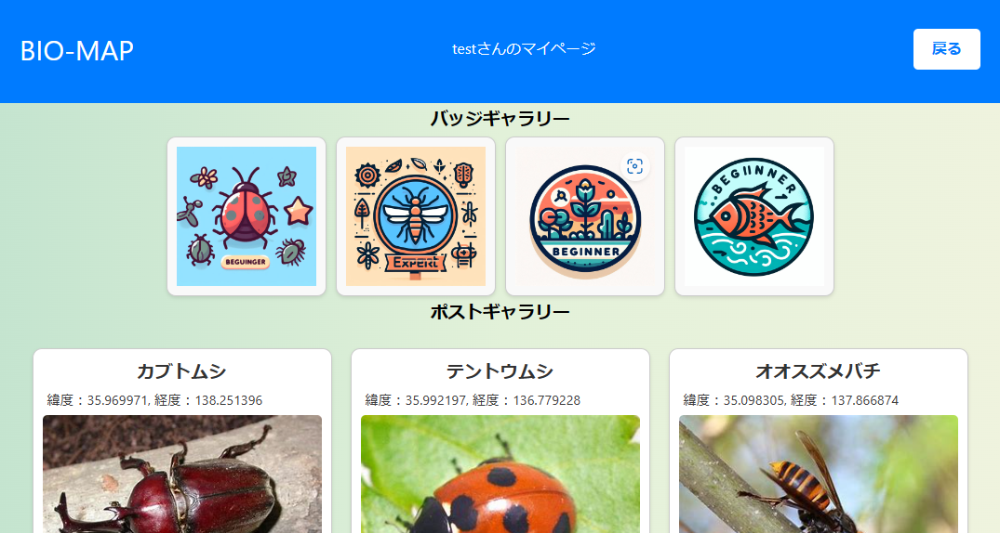

# サービスのURL

# サービスへの想い
このプロダクトは，普段私たちの身近にいる生物の写真を撮りはしたが，フォルダーの底に眠っている写真があることに気づき，そのような写真を共有したいという想いから生まれました．「ふと身近にいた生物の写真を共有したい．しかし，インスタやXに投稿するのは躊躇する．また，身近にどんな生物がいるのかを知りたい．他にも，身近に要る危険生物（毒グモ，毒ヘビなど）から身を守りたい．生物の図鑑を埋めたい」というような場合に，このサービスは真価を発揮します．また現在は，特にユーザ志向の設計にはこだわっており，より投稿したくなるようなバッジ機能や，より検索しやすいような絞り込み機能を追加し，ユーザが利用しやすいサービスを目指しています．

# 主なページと機能
<table>
  <tr>
    <td>
      <h3 style="text-align: center">トップページ</h3>
      
      

      地図を最大限表示し，ユーザに見やすいように設計しました．
      

      </td>
    <td>
      <h3 style="text-align: center">ログインページ</h3>
      
      

      ユーザ名もしくはパスワードを間違うとエラーメッセージが表示されます．
      

    </td>
  </tr>
  <tr>
    <td>
      <h3 style="text-align: center">サインアップページ</h3>
      
      

      パスワードは，全探索でハックされない堅牢な条件が付けられています．
      

    </td>
    <td>
      <h3 style="text-align: center">検索機能</h3>
      
      

      検索に一致する投稿をマーカーで表示し，クリックすると投稿された情報を閲覧することができる．ヘッダーには，ヒットした件数が表示される．
      

    </td>
  </tr>
  <tr>
    <td>
      <h3 style="text-align: center">投稿機能</h3>
      
      

      地図をクリックするとフォームが開き，名前，画像，コメントを記入することで，簡単に投稿することができる．
      

    </td>
    <td>
      <h3 style="text-align: center">マイページ</h3>
      
      

      一定の条件を満たすことで，バッチを獲得することができる．過去に投降した情報を閲覧することもできる．
      

    </td>
  </tr>
</table>

# 使用技術
## バックエンド
- Golang 1.21.3
## フロントエンド
- React 18.2.0
## インフラ
- vercel
- Render
- Firebase

# インフラ構成図

